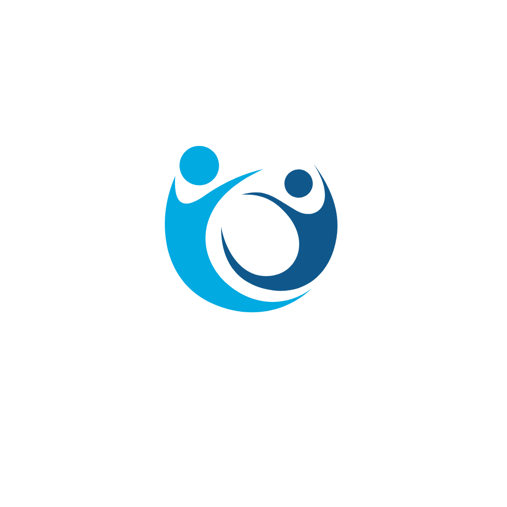

# Sistema Clínico da Clínica André Luiz
Plataforma desenvolvida para gerenciamento de pacientes, agendamentos e tratamentos terapêuticos da Clínica André Luiz de Reabilitação e Tratamentos Terapêuticos. O sistema tem como objetivo otimizar os processos internos da clínica, facilitando o acompanhamento dos pacientes e a organização das atividades terapêuticas.

# Sistema Clínico — Clínica André Luiz

## Sumário
- [Ideia do Projeto](#ideia-do-projeto)
- [Objetivos](#objetivos)
- [Funcionalidades Principais](#funcionalidades-principais)
- [Codificação e Arquitetura](#codificacao-e-arquitetura)
- [Galeria de Imagens](#galeria-de-imagens)
- [Como Executar](#como-executar)
- [Contato](#contato)

---

## Ideia do Projeto

O projeto propõe o desenvolvimento de um sistema integrado para a **Clínica André Luiz — Reabilitação e Tratamentos Terapêuticos**, com foco em pacientes em tratamento de dependência química. A plataforma centralizará gestão de cadastros, agendamentos (presenciais e teleconsulta segura), prontuários eletrônicos, e workflows para acompanhamento terapêutico. 

Objetivos técnicos:
- Garantir autenticação e comunicação segura para o primeiro contato e teleconsultas.
- Fornecer histórico clínico acessível apenas a profissionais autorizados.
- Suportar relatórios e indicadores para avaliar progresso terapêutico.
- Ser escalável como base para futuras integrações (telemedicina avançada, análise de dados, notificações automáticas).

Este TCC marca o início de uma solução que alia tecnologia e cuidado clínico para aumentar a eficiência do atendimento e a qualidade da reabilitação.

---
## Ideia do Projeto — Minha Visão

Minha inspiração vem do desejo de unir tecnologia e empatia para transformar a forma como o cuidado clínico é oferecido. A **Clínica André Luiz**, especializada em reabilitação de dependência química, representa o início dessa jornada: um espaço onde a inovação pode apoiar a recuperação e o acolhimento humano.

Mais do que um projeto acadêmico, este **TCC é o primeiro passo de uma iniciativa que busca usar a tecnologia para fortalecer vínculos, facilitar o tratamento e oferecer suporte real tanto para pacientes quanto para profissionais de saúde**, com ética, segurança e sensibilidade.

---

## Objetivos
- Digitalizar e organizar registros de pacientes.
- Agilizar o agendamento e controle de sessões terapêuticas.
- Permitir acompanhamento do progresso terapêutico por profissionais autorizados.
- Gerar relatórios para administração e qualidade assistencial.
- Garantir segurança e privacidade das informações (conformidade com boas práticas).

---

## Funcionalidades Principais
- Cadastro e gestão de pacientes.
- Agendamento e calendário integrado.
- Registro de atendimentos e evolução clínica.
- Perfis de usuários (administrador, terapeuta, recepção).
- Exportação de relatórios e backup automático.
- Dashboard com indicadores (ocupação, atendimentos, etc).

---

## Codificação e Arquitetura
A documentação técnica detalhada e o código-fonte encontram-se na página de codificação:

- [Ver documentação de codificação (arquitetura, tecnologias e estrutura)](./CODIFICACAO.md){:target="_blank"}

> Observação: no GitHub, o link abre a página `CODIFICACAO.md`. Use o botão direito e "Abrir em nova aba" caso queira manter o README aberto.

---

## Galeria de Imagens
Imagens do projeto, mockups e prints estão em:

- [Abrir galeria de imagens](./IMAGENS.md)

---

